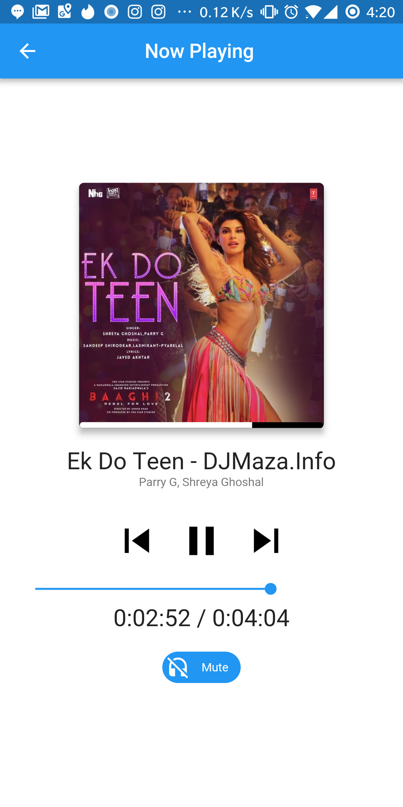

# Flutter Music Player

First Open Source Flutter based Beautiful Material Design Music Player(Online Radio will be added soon.)

## Features

* [x] Android (iOS Coming Soon)

  * [x] Fetch local songs (Inbuilt Permission)
  * [x] Beautiful UI with multiple themes(Coming Soon)
  * [x] Animation
  * [x] Full Fledged Example
  * [x] play (local files)
  * [x] stop
  * [x] pause
  * [x] seek
  * [x] shuffle
  * [x] Album Art
  * [x] onComplete
  * [x] onDuration / onCurrentPosition

* Supported formats

  * [Android](https://developer.android.com/guide/topics/media/media-formats.html)

### Show some :heart: and star the repo to support the project

### Screenshots

    

## iOS

### Alert: iOS implementation

This project is not implemented for ios yet.So wait for it or if you can contribute then please do help.

## Getting Started

For help getting started with Flutter, view our online
[documentation](http://flutter.io/).

For help on editing plugin code, view the [documentation](https://flutter.io/platform-plugins/#edit-code).
